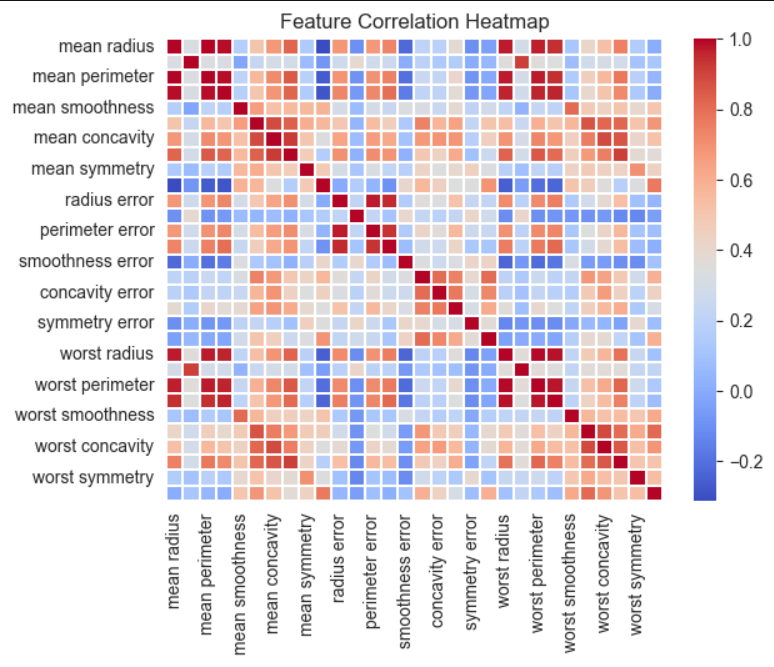
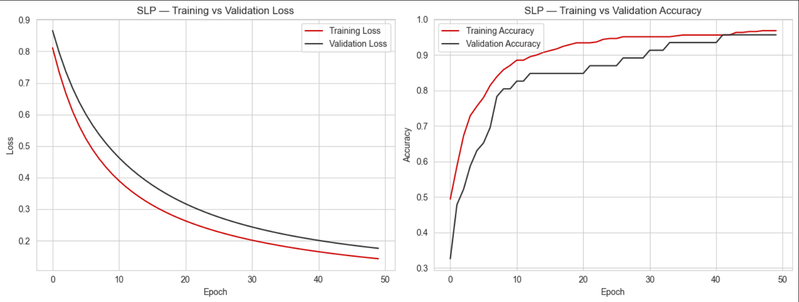
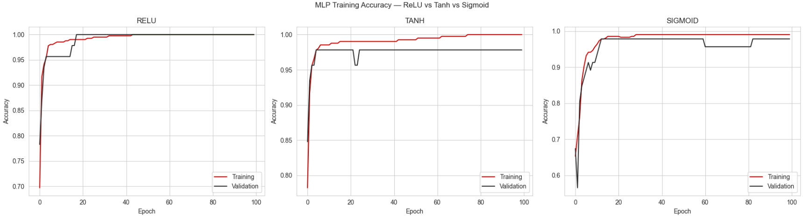
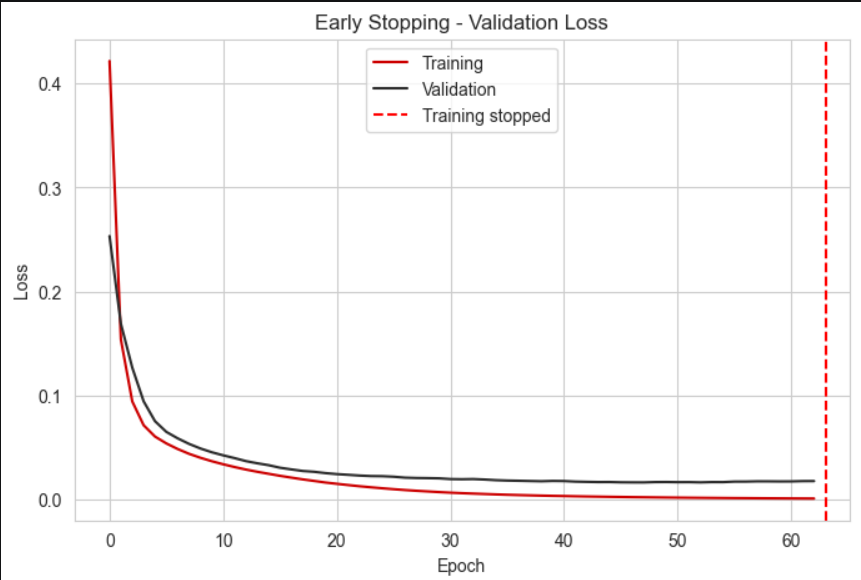
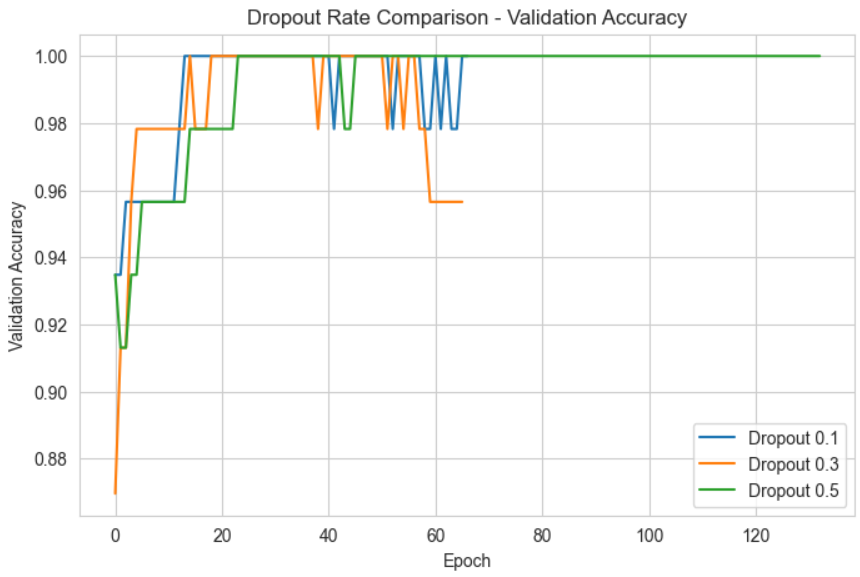
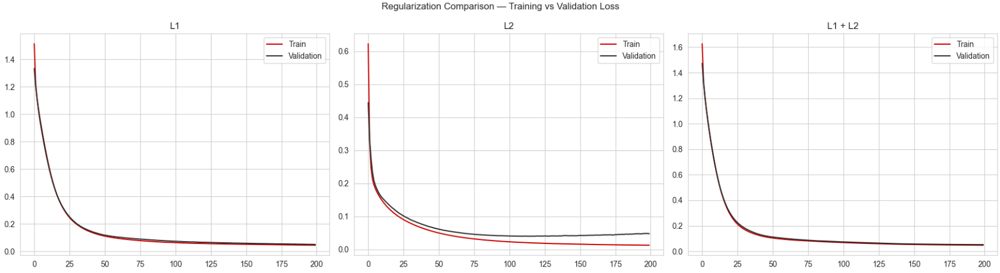
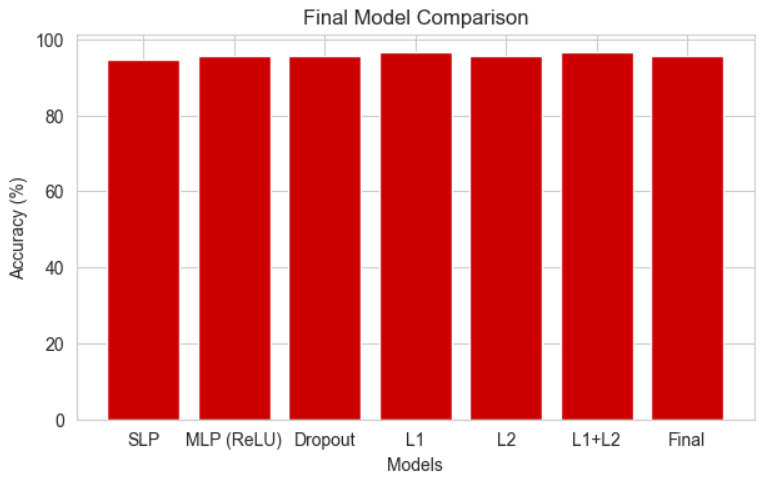

# Deep Learning PR 1 — Breast Cancer Wisconsin (Diagnostic)


## 📌 Project Overview

This project implements **Deep Learning PR 1** using the **Breast Cancer Wisconsin (Diagnostic)** dataset available through `sklearn.datasets.load_breast_cancer(as_frame=True)`.

The notebook follows the PR task sequence and studies how a neural-network classifier changes as different architectures and regularization techniques are introduced:

- Single-Layer Perceptron (SLP) baseline
- Multi-Layer Perceptron (MLP)
- Data scaling and preprocessing
- ReLU, Tanh and Sigmoid activation functions
- Early Stopping
- Dropout
- L1, L2 and combined L1+L2 regularization
- Final combined model
- Test-set evaluation and model comparison

> **Note:** This README is based on the uploaded `DLPR1.ipynb`, `requirements.txt`, and the seven submitted screenshots. No unsupported project details have been added.

---

## 🎯 Objectives

1. Load and inspect the Breast Cancer Wisconsin diagnostic dataset.
2. Analyze class distribution and feature correlations.
3. Split the data using stratification and standardize features without test-data leakage.
4. Build an SLP as a baseline classifier.
5. Build an MLP and compare ReLU, Tanh and Sigmoid hidden-layer activations.
6. Demonstrate Early Stopping as a regularization technique.
7. Compare Dropout rates of 0.1, 0.3 and 0.5.
8. Compare L1, L2 and L1+L2 regularization.
9. Combine effective techniques into a final neural-network model.
10. Compare model accuracy and discuss clinical decision-support considerations.

---

## 📊 Dataset

The notebook loads the dataset directly with:

```python
from sklearn.datasets import load_breast_cancer

data = load_breast_cancer(as_frame=True)
```

### Dataset shape

- **Rows:** 569
- **Input features:** 30
- **Target:** Binary classification
- **Target classes:**
  - `0` — Malignant: 212 samples
  - `1` — Benign: 357 samples

The notebook describes this as a **mild class imbalance** and preserves the class ratio through stratified splitting rather than automatically applying resampling.

### Train/Test Split

The project uses:

- `test_size=0.2`
- `random_state=42`
- `stratify=y`

This produces a held-out test set of **114 samples**.

---

## 🔄 Data Preprocessing

### 1. Feature/target separation

```python
X, y = data.data, data.target
```

### 2. Stratified train/test split

```python
X_train, X_test, y_train, y_test = train_test_split(
    X, y,
    test_size=0.2,
    random_state=42,
    stratify=y
)
```

### 3. Standardization

`StandardScaler` is fitted **only on the training data** and then applied to both training and test sets.

```python
scaler = StandardScaler().fit(X_train)
X_train_sc = scaler.transform(X_train)
X_test_sc = scaler.transform(X_test)
```

This avoids test-set leakage and places features on comparable scales, which supports more stable gradient-based neural-network training.

---

## 🔍 Exploratory Data Analysis

### Class Distribution

The notebook checks the target distribution and identifies 212 malignant and 357 benign observations.

### Feature Correlation

The correlation analysis highlights strong relationships among several measurements, including radius, perimeter, area and corresponding “worst” measurements.

### Feature Correlation Heatmap



---

# 🧠 Deep Learning Experiments

## 1. Single-Layer Perceptron (SLP)

The baseline model contains a single sigmoid neuron:

```text
30 input features → Dense(1, sigmoid)
```

### Configuration

- Optimizer: `Adam`
- Loss: `binary_crossentropy`
- Metric: `accuracy`
- Epochs: `50`
- Batch size: `32`
- Validation split: `0.1`
- Parameters: **31** (30 weights + 1 bias)

Binary cross-entropy is used because the task is binary classification and the sigmoid output represents a probability.

### SLP Training Curves



### SLP Test Result

The recorded notebook output reports:

**Test Accuracy: 94.74%**

Classification report:

| Class | Precision | Recall | F1-score | Support |
|---|---:|---:|---:|---:|
| Malignant (0) | 0.95 | 0.90 | 0.93 | 42 |
| Benign (1) | 0.95 | 0.97 | 0.96 | 72 |
| **Accuracy** | | | **0.95** | **114** |

The SLP is intentionally used as a baseline because it can learn only a single linear decision boundary.

---

## 2. Multi-Layer Perceptron (MLP)

The project then adds hidden layers and compares three activation functions using the same architecture:

```text
30 inputs → Dense(64) → Dense(32) → Dense(1, sigmoid)
```

### Activation functions compared

- **ReLU** — `max(0, x)`
- **Tanh** — outputs values in `(-1, 1)`
- **Sigmoid** — outputs values in `(0, 1)`

All three variants use the same training setup and are trained for **100 epochs**.

### Activation Function Comparison



The notebook concludes that **ReLU** provided the best overall validation behavior among the three hidden-layer activation functions in this run and was therefore used for the MLP comparison.

---

## 3. Early Stopping

Early Stopping monitors validation loss and stops training when improvement stalls.

### Configuration

- Monitor: `val_loss`
- Patience: `15`
- `restore_best_weights=True`
- Maximum epochs: `300`
- Batch size: `32`

The recorded notebook output reports a **96.49% test accuracy** for the Early Stopping model.

### Early Stopping Curve



### Why Early Stopping?

It helps reduce unnecessary training, limits overfitting after validation improvement stalls, and restores the best observed validation-loss weights.

---

## 4. Dropout

The project compares three dropout rates:

- `0.1`
- `0.3`
- `0.5`

The tested architecture uses two hidden layers with 128 and 64 ReLU units, with Dropout inserted after each hidden layer.

Each model uses Early Stopping with a patience of 20 and a maximum of 200 epochs.

### Dropout Comparison



The notebook evaluates the `Dropout 0.3` model in the recorded test evaluation, obtaining:

**Test Accuracy: 95.61%**

The notebook explains that a middle dropout rate can balance regularization and learning capacity, while the actual validation curves should be used to choose the empirical winner.

---

## 5. Regularization

Three weight-regularization strategies are compared:

### L1 Regularization

Uses a penalty proportional to the absolute value of weights:

```text
λ × Σ|w|
```

It can encourage sparse representations and may drive some weights toward zero.

### L2 Regularization

Uses a squared-weight penalty:

```text
λ × Σw²
```

It discourages large weights and tends to produce smoother weight distributions.

### L1 + L2 Regularization

Combines the sparsity effect of L1 with the weight-shrinkage effect of L2.

### Regularization Configuration

The notebook uses `0.001` for the regularization strength in the L1, L2 and combined L1+L2 experiments.

### Regularization Curves



---

# 🏆 Final Model

The final model combines the techniques selected in the project:

```text
Input: 30 standardized features
        ↓
Dense(128, ReLU, L2=0.001)
        ↓
Dropout(0.3)
        ↓
Dense(64, ReLU, L2=0.001)
        ↓
Dropout(0.3)
        ↓
Dense(1, Sigmoid)
```

### Final Training Setup

- Optimizer: `Adam`
- Loss: `binary_crossentropy`
- Batch size: `32`
- Maximum epochs: `200`
- Early Stopping monitor: `val_loss`
- Early Stopping patience: `20`
- Restore best weights: enabled
- L2 regularization: `0.001`
- Dropout: `0.3`

### Final Model Accuracy

The recorded notebook output reports:

**Final Model Accuracy: 95.61%**

### Final Classification Report

| Class | Precision | Recall | F1-score | Support |
|---|---:|---:|---:|---:|
| Malignant (0) | 0.91 | **0.98** | 0.94 | 42 |
| Benign (1) | 0.99 | 0.94 | 0.96 | 72 |
| **Accuracy** | | | **0.96** | **114** |
| Macro Avg | 0.95 | 0.96 | 0.95 | 114 |
| Weighted Avg | 0.96 | 0.96 | 0.96 | 114 |

### Final Model Comparison



| Model | Test Accuracy |
|---|---:|
| SLP | **94.74%** |
| MLP (ReLU) | **95.61%** |
| Dropout | **95.61%** |
| L1 | **96.49%** |
| L2 | **95.61%** |
| L1 + L2 | **96.49%** |
| Final | **95.61%** |

> The values above are taken from the recorded output of the uploaded notebook. The highest recorded test accuracy in the comparison is **96.49%**, achieved by both the L1 and L1+L2 models. The final combined model records **95.61%** in the uploaded run.

---

# 🏥 Clinical Decision-Support Insight

The notebook frames the final model as a candidate for a **clinical decision-support tool**, not as a replacement for clinical diagnosis.

For this application, the notebook emphasizes that **recall for the Malignant class (class 0)** is particularly important because a false negative can be more costly than a false positive.

In the recorded final classification report:

- Malignant recall: **0.98**
- Benign recall: **0.94**
- Overall accuracy: **95.61%**

The notebook also discusses lowering the default 0.5 classification threshold when appropriate to prioritize malignant-case recall, with the exact threshold to be selected using validation data and cost-sensitive analysis.

> **Important:** This is an academic machine-learning project. It should not be treated as a clinically validated diagnostic system.

---

# 📈 Key Findings

1. **Standardization** is applied correctly by fitting the scaler only on training data.
2. The **SLP baseline** reaches 94.74% test accuracy.
3. Adding hidden layers improves the baseline performance in this run.
4. **ReLU** is selected as the preferred hidden-layer activation based on the notebook's validation comparison.
5. **Early Stopping** reaches 96.49% test accuracy in the recorded run.
6. The tested `Dropout(0.3)` model reaches 95.61% test accuracy.
7. **L1** and **L1+L2** each record the highest test accuracy in the final comparison at **96.49%**.
8. The final combined model records **95.61%** accuracy and **0.98 recall for Malignant cases**.
9. For medical decision support, the notebook recommends focusing on **Malignant-class recall**, not accuracy alone.

---

# 🛠️ Technologies Used

- Python
- TensorFlow
- Keras
- NumPy
- Pandas
- Matplotlib
- Seaborn
- Scikit-learn
- SciPy

---

# 💻 Environment & Requirements

The uploaded `requirements.txt` specifies:

```text
Python==3.12.7
tensorflow==2.21.0
keras==3.15.1
numpy==2.3.5
pandas==2.3.3
matplotlib==3.10.0
seaborn==0.13.2
scikit-learn==1.9.0
scipy==1.16.3
```

The exact package versions are also preserved in the uploaded `requirements.txt` file.

---

# 🚀 Installation

### 1. Clone the repository

```bash
git clone <YOUR_GITHUB_REPOSITORY_URL>
cd <YOUR_PROJECT_FOLDER>
```

### 2. Create a virtual environment

```bash
python -m venv venv
```

### 3. Activate the environment

**Windows:**

```bash
venv\Scripts\activate
```

**macOS/Linux:**

```bash
source venv/bin/activate
```

### 4. Install dependencies

```bash
pip install -r requirements.txt
```

### 5. Launch the notebook

```bash
jupyter notebook DLPR1.ipynb
```

Run the notebook from top to bottom to reproduce the preprocessing, experiments, plots and model comparison.

---

# 📁 Recommended Repository Structure

```text
DLPR1/
│
├── DLPR1.ipynb
├── requirements.txt
├── README.md
│
└── assets/
    ├── 01-feature-correlation-heatmap.png
    ├── 02-slp-training-curves.png
    ├── 03-activation-functions.png
    ├── 04-early-stopping.png
    ├── 05-dropout-comparison.png
    ├── 06-regularization-comparison.png
    └── 07-final-model-comparison.png
```

The screenshots included with this README are already renamed and organized under `assets/` in the accompanying package.

---

# 🎥 Video Submission

**Video Submission Link:**

> 🔗 **https://drive.google.com/file/d/1k48MjQ9aLKaWxpdAduNMvBJxL7FN3RYf/view?usp=sharing**

### Suggested submission format

Replace the placeholder above with your actual:

- YouTube unlisted/public link, or
- Google Drive sharing link, or
- Institution-provided submission link.

**Do not submit the placeholder.** Make sure the final video URL has the required viewing permissions before submission.

---

# 📚 Project Files

- `DLPR1.ipynb` — Complete Deep Learning PR 1 notebook
- `requirements.txt` — Exact Python/package versions used in the project
- `assets/` — Submitted project screenshots used throughout this README

---

# 👤 Author

**Name:** Dharmik Pansuriya  
**Program:** B.Sc. IT / AI & ML / Data Science  
**Project:** Deep Learning PR 1

---

# 📄 Academic Note

This repository is prepared for academic/project submission. Results shown in this README correspond to the recorded outputs and screenshots supplied with the project. Neural-network results can vary slightly when the notebook is retrained on a different environment or with different random states.

---

## ⭐ Summary

This project demonstrates a complete neural-network classification workflow on the Breast Cancer Wisconsin diagnostic dataset, progressing from a simple **SLP baseline** to an **MLP with activation-function comparison**, followed by **Early Stopping**, **Dropout**, **L1/L2 regularization**, and a **final combined architecture**. The experiments show how architecture and regularization choices affect generalization and why medical classification should pay particular attention to malignant-case recall.
