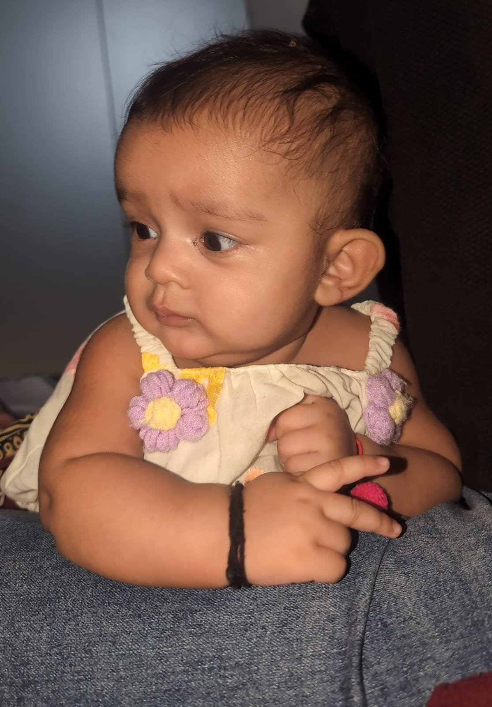
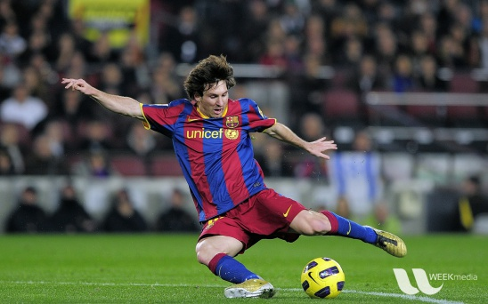

# 👁️ Computer Vision Project — OpenCV, YuNet & YOLOv8

A practical **Computer Vision project** demonstrating classical image-processing techniques and modern deep-learning-based object detection using **OpenCV, YuNet, and YOLOv8**.

The project covers image preprocessing, grayscale conversion, thresholding, morphological operations, bitwise operations, masking, histograms, brightness and contrast adjustment, face detection, and real-time-style object detection.

---

## 📌 Project Overview

This project was created to understand how different **computer vision techniques** work in practical applications.

It combines:

- 🖼️ Image Processing
- ⚫ Grayscale & Binary Images
- 🧹 Morphological Operations
- 🔀 Bitwise Operations
- 🎭 ROI & Masking
- 📊 Image Histograms
- ☀️ Brightness Adjustment
- 🎚️ Contrast Adjustment
- 👤 Face Detection using YuNet
- 🎯 Object Detection using YOLOv8
- 📈 Confidence & IoU Experiments
- 📦 Non-Maximum Suppression (NMS)
- 📊 Detection Count & Class Analysis

---

## 🗂️ Project Structure

```text
PR3/
│
├── 📓 PR3.IPYNB
├── 📄 README.md
│
├── 🖼️ images/
│   ├── baboon.jpg
│   ├── board.jpg
│   ├── digits.png
│   ├── face1.jpeg
│   ├── face2.jpg
│   ├── fruits.jpg
│   ├── home.jpg
│   ├── lena.jpg
│   ├── messi5.jpg
│   └── smarties.png
│
└── 🤖 models/
    ├── face_detection_yunet_2023mar.onnx
    └── yolov8n.pt
```

> ⚠️ **Important:** Keep the `images` and `models` folders in the correct location relative to `PR3.IPYNB`. The notebook uses relative paths to access images and model files.

---

# 🛠️ Technologies Used

| Technology | Purpose |
|---|---|
| 🐍 Python | Programming Language |
| 👁️ OpenCV | Image Processing & Computer Vision |
| 🔢 NumPy | Numerical Operations |
| 📊 Matplotlib | Visualization & Histograms |
| 🎯 Ultralytics YOLOv8 | Object Detection |
| 👤 YuNet | Face Detection |
| 📓 Jupyter Notebook | Project Development |

---

# ⚙️ Installation

Install the required Python libraries using:

```bash
pip install opencv-python opencv-contrib-python ultralytics matplotlib numpy
```

You can verify the installation with:

```python
import cv2
import numpy as np
import matplotlib
import ultralytics

print("OpenCV:", cv2.__version__)
print("NumPy:", np.__version__)
print("Matplotlib:", matplotlib.__version__)
```

---

# 🚀 How to Run

### 1️⃣ Clone or download the project

Place the complete project folder on your computer.

### 2️⃣ Open the notebook

Open:

```text
PR3.IPYNB
```

using **Jupyter Notebook, JupyterLab, or VS Code**.

### 3️⃣ Check the project folders

Make sure the project contains:

```text
images/
models/
PR3.IPYNB
```

### 4️⃣ Run the notebook

Run the cells **from top to bottom**.

---

# 🖼️ 1. Image Processing

The project begins with fundamental image-processing operations.

Images are loaded using OpenCV and displayed using Matplotlib.

Example:

```python
img = cv2.imread("images/lena.jpg")
```

The project works with different images including:

- Lena
- Baboon
- Fruits
- Smarties
- Digits
- Messi
- Home
- Face images

### 🔄 Basic Processing

The following operations are demonstrated:

- Image loading
- Image display
- Color conversion
- Grayscale conversion
- Binary thresholding
- Image resizing
- Image visualization

---

# ⚫ 2. Grayscale & Binary Thresholding

A color image can be converted into grayscale to simplify further processing.

```text
RGB Image
    ↓
Grayscale Image
    ↓
Thresholding
    ↓
Binary Image
```

Binary thresholding separates pixels into foreground and background regions.

This is useful for:

- Object separation
- Shape analysis
- Contour detection
- Morphological processing

---

# 🧹 3. Morphological Operations

Morphological operations are used to process the structure and shape of objects in binary images.

The project demonstrates:

### 🔹 Erosion

Erosion removes pixels around object boundaries and can help remove small noise.

### 🔹 Dilation

Dilation expands object boundaries and can help connect nearby regions.

### 🔹 Opening

Opening is:

```text
Erosion → Dilation
```

It is useful for removing small bright noise.

### 🔹 Closing

Closing is:

```text
Dilation → Erosion
```

It helps fill small gaps and holes.

---

# 🔬 4. Structuring Element Comparison

Different kernel shapes and sizes are compared to understand their effect on morphological processing.

### Kernel Shapes

- ▭ Rectangular
- ⚪ Elliptical
- ✚ Cross-shaped

### Kernel Sizes

```text
3 × 3
5 × 5
9 × 9
```

Increasing the kernel size generally produces a stronger morphological effect.

---

# 🔀 5. Bitwise Operations

Bitwise operations are performed on image masks.

The project demonstrates:

| Operation | Description |
|---|---|
| AND | Keeps common regions |
| OR | Combines regions |
| XOR | Keeps different regions |
| NOT | Inverts the mask |

These operations are useful for:

- Mask creation
- Image segmentation
- Region extraction
- Combining image regions

---

# 🎭 6. Circular ROI Masking

A circular **Region of Interest (ROI)** is created to extract a selected area from an image.

The process demonstrates how masks can be used to focus computer-vision operations on a specific region.

```text
Original Image
      ↓
Circular Mask
      ↓
Selected ROI
```

---

# 📊 7. Image Histograms

Histograms are used to understand the distribution of pixel intensities.

### Grayscale Histogram

Shows the distribution of intensity values from:

```text
0 → Black
255 → White
```

### RGB Histogram

The project also visualizes the intensity distribution of:

- 🔴 Red
- 🟢 Green
- 🔵 Blue

Histograms help analyze image exposure, brightness, and contrast.

---

# ☀️ 8. Brightness & Contrast Adjustment

Brightness and contrast are adjusted using the transformation:

```text
new_pixel = α × pixel + β
```

Where:

- `α` → Controls contrast
- `β` → Controls brightness

### Example

```text
Original
   ↓
Brightness Increased
   ↓
Brightness Decreased
   ↓
Histogram Comparison
```

This demonstrates how pixel intensity changes affect the overall appearance of an image.

---

# 👤 9. Face Detection using YuNet

The project uses **YuNet**, an ONNX-based lightweight face detector.

YuNet provides:

- 👤 Face bounding boxes
- 📈 Confidence scores
- 👁️ Facial landmarks

For each detected face, YuNet can provide **five facial landmark points**:

- Left eye
- Right eye
- Nose
- Left mouth corner
- Right mouth corner

### YuNet Model

```text
models/face_detection_yunet_2023mar.onnx
```

---

## 🎚️ YuNet Confidence Threshold

Different confidence/score thresholds are tested to understand their effect on face detection.

A lower threshold may detect more faces but can also increase false positives.

A higher threshold generally produces fewer but more confident detections.

---

# 🎯 10. Object Detection using YOLOv8

The project uses **YOLOv8n** for general-purpose object detection.

YOLO can identify multiple objects in an image and provide:

- 📦 Bounding boxes
- 🏷️ Object classes
- 📈 Confidence scores

The model used in this project is:

```text
models/yolov8n.pt
```

Example images include:

```text
messi5.jpg
home.jpg
```

---

# 📦 YOLO Detection Workflow

```text
Input Image
     ↓
YOLOv8 Model
     ↓
Object Detection
     ↓
Bounding Boxes
     ↓
Class Labels
     ↓
Confidence Scores
```

This demonstrates a complete deep-learning object-detection workflow.

---

# 🎚️ 11. Confidence Threshold Experiment

The confidence threshold controls how confident YOLO must be before keeping a detection.

For example:

```text
Low Confidence Threshold
        ↓
More detections
        ↓
Potentially more false positives
```

While:

```text
High Confidence Threshold
        ↓
Fewer detections
        ↓
More confident predictions
```

The project compares detection counts at different confidence levels.

---

# 📐 12. IoU & Non-Maximum Suppression

The project also explores **Intersection over Union (IoU)** and **Non-Maximum Suppression (NMS)**.

### IoU

IoU measures the overlap between two bounding boxes.

```text
IoU = Area of Intersection
      ---------------------
      Area of Union
```

A higher IoU means that two boxes overlap more strongly.

### NMS

Non-Maximum Suppression removes duplicate or highly overlapping bounding boxes and keeps the most confident prediction.

---

# 📈 13. Detection Count & Class Analysis

YOLO detection results are analyzed to understand:

- Total number of detected objects
- Detection count by class
- Confidence threshold effects
- IoU threshold effects
- Changes in retained bounding boxes

This provides a practical understanding of how detection parameters influence model output.

---

# 🖼️ Project Results

## 🔬 Image Processing

The project demonstrates how different preprocessing and morphological operations change the structure of an image.


---

## 🧹 Morphology Results

Examples of the morphological processing performed in the notebook include:

```text
Original
   ↓
Binary Image
   ↓
Erosion
   ↓
Dilation
   ↓
Opening
   ↓
Closing
```

> 📸 Add your notebook output screenshots here if you want to show the actual morphology results.

---

## 👤 YuNet Face Detection

YuNet detects faces using bounding boxes and facial landmarks.



> The exact output depends on the input image and confidence threshold.

---

## 🎯 YOLOv8 Object Detection

YOLOv8 detects objects and draws bounding boxes with class labels and confidence scores.




---

# 📊 Key Observations

### 🖼️ Image Processing

Morphological operations are highly dependent on the kernel shape and size. Larger kernels produce stronger changes to object boundaries.

### 🔀 Bitwise Operations

Bitwise operations are useful for combining masks and selecting specific image regions.

### 📊 Histograms

Histograms provide a useful representation of image intensity and can help identify changes in exposure and contrast.

### 👤 YuNet

YuNet provides lightweight face detection along with useful facial landmark information.

### 🎯 YOLOv8

YOLOv8n provides fast object detection and can detect multiple object classes in a single image.

### 🎚️ Thresholds

Changing confidence and IoU thresholds directly affects the number of retained detections.

---

# 🧠 What I Learned

Through this project, I learned how to:

- ✅ Load and process images using OpenCV
- ✅ Convert images between color spaces
- ✅ Perform binary thresholding
- ✅ Apply erosion and dilation
- ✅ Use opening and closing
- ✅ Compare different morphological kernels
- ✅ Perform bitwise image operations
- ✅ Create ROI masks
- ✅ Generate and interpret histograms
- ✅ Adjust brightness and contrast
- ✅ Perform face detection using YuNet
- ✅ Work with ONNX face-detection models
- ✅ Perform object detection using YOLOv8
- ✅ Understand confidence thresholds
- ✅ Understand IoU and NMS
- ✅ Analyze object-detection results

---

# 📁 Models

## 👤 YuNet

Place the YuNet model inside:

```text
models/face_detection_yunet_2023mar.onnx
```

## 🎯 YOLOv8

Place the YOLOv8 model inside:

```text
models/yolov8n.pt
```

---

# ⚠️ Important Notes

Make sure the relative paths in the notebook match the actual project structure.

For the structure shown in this README:

```python
cv2.imread("images/lena.jpg")
```

and:

```text
models/
```

should be located beside the notebook.

If your notebook specifically uses:

```text
data/images/
```

then create and maintain that folder structure instead.

---

# 🏁 Conclusion

This project provides a practical introduction to **Computer Vision**, starting with classical image-processing techniques and progressing toward modern deep-learning-based detection.

The project demonstrates how **OpenCV** can be used for image manipulation, morphology, masking, and histogram analysis, while **YuNet** and **YOLOv8** can be used for face and object detection.

Overall, the project helped build a strong understanding of the complete computer-vision workflow:

```text
Image Input
     ↓
Preprocessing
     ↓
Image Analysis
     ↓
Feature/Region Processing
     ↓
Face / Object Detection
     ↓
Threshold Analysis
     ↓
Result Visualization
```

---

# 👨‍💻 Author

**Computer Vision Practical Project**

Built using **Python, OpenCV, YuNet and YOLOv8**.

⭐ If you found this project useful, consider giving the repository a star!